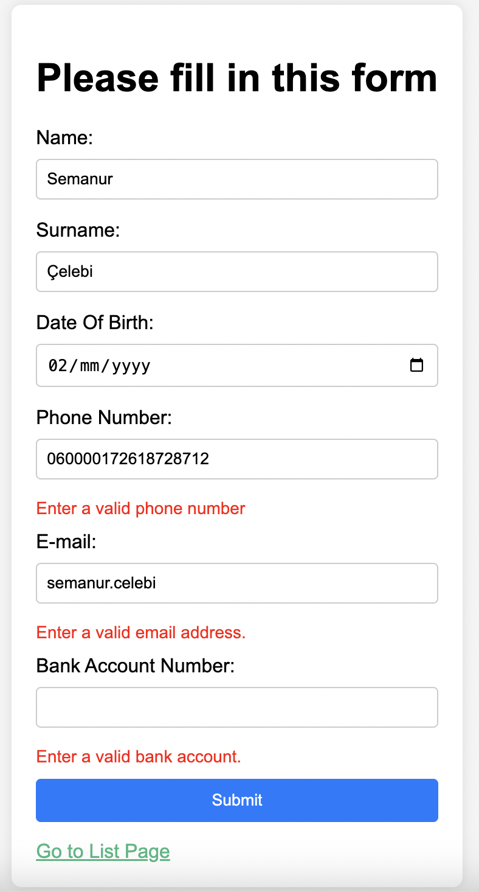

# Customer CRUD Project 

A simple CRUD application with VueJS that implements the below model:
```
Customer {
	Firstname
	Lastname
	DateOfBirth
	PhoneNumber
	Email
	BankAccountNumber
}
```

### Validations

- During createtion; validated the phone number to be a valid *mobile* number only (We used  [Google LibPhoneNumber](https://github.com/google/libphonenumber) to validate mobile number).

- A valid email and a valid account number has been checked before submitting the form.

- A browser local storage has been created to store the list of customers.

- It was checked that the customers' "Name", "Surname" and "Date of Birth" information were unique in the database.

- "Email" is unique in local storage.

### Tests

- Unit test codes of all validations are written in the following directory
[Unit Tests](tests/unit/validation.spec.js)


